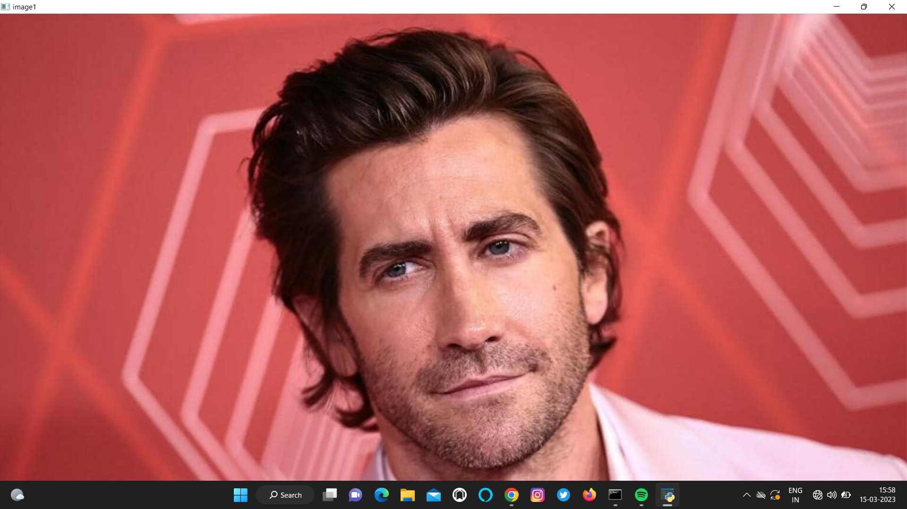
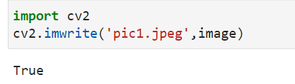
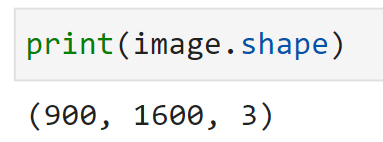
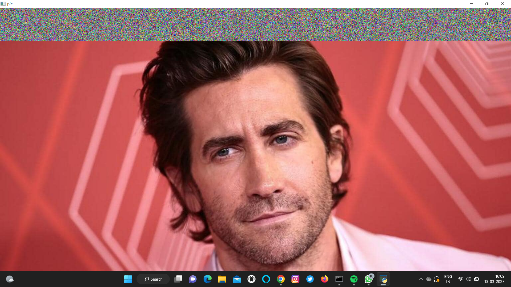

# READ AND WRITE AN IMAGE
## AIM
To write a python program using OpenCV to do the following image manipulations.
i) Read, display, and write an image.
ii) Access the rows and columns in an image.
iii) Cut and paste a small portion of the image.

## Software Required:
Anaconda - Python 3.7
## Algorithm:
### Step1:
Choose an image and save it as a filename.jpg
### Step2:
Use imread(filename, flags) to read the file.
### Step3:
Use imshow(window_name, image) to display the image.
### Step4:
Use imwrite(filename, image) to write the image.
### Step5:
End the program and close the output image windows.
## Program: Python
### Developed By: Barath S
### Register Number: 212222230018

i) #To Read,display the image
```python
import cv2
image = cv2.imread('Pictures/digi.jpg',1)
cv2.imshow('imgae',image)
cv2.waitKey(0)
cv2.destroyAllWindows()
```
ii) #To write the image
```python
import cv2
cv2.imwrite('pic1.jpeg',image)
```
iii) #Find the shape of the Image
```python
print(image.shape)
```
iv) #To access rows and columns

```python
import random
for i in range(100):
    for j in range(image.shape[1]):
        image[i][j]=[random.randint(0,255),random.randint(0,255),random.randint(0,255)]
cv2.imshow('pic',image)
cv2.waitKey(0)
```
v) #To cut and paste portion of image
```python
import cv2


pic2=cv2.imread("Pictures/2f731094-a9c1-11ec-9297-ed70bb26c8ff_1648825261500.jpg",1)
pic2 = cv2.resize(pic2, (300, 430))
pic2[500:550,500:550]=[0,0,0]

cut= pic2[37:111,108:195]
pic2[0:74,0:87]=cut

cv2.imshow('imagw3',pic2)
cv2.waitKey(0)
cv2.destroyAllWindows()
```

## Output:

### i) Read and display the image



### ii)Write the image



### iii)Shape of the Image



### iv)Access rows and columns


### v)Cut and paste portion of image


## Result:
Thus the images are read, displayed, and written successfully using the python program.


